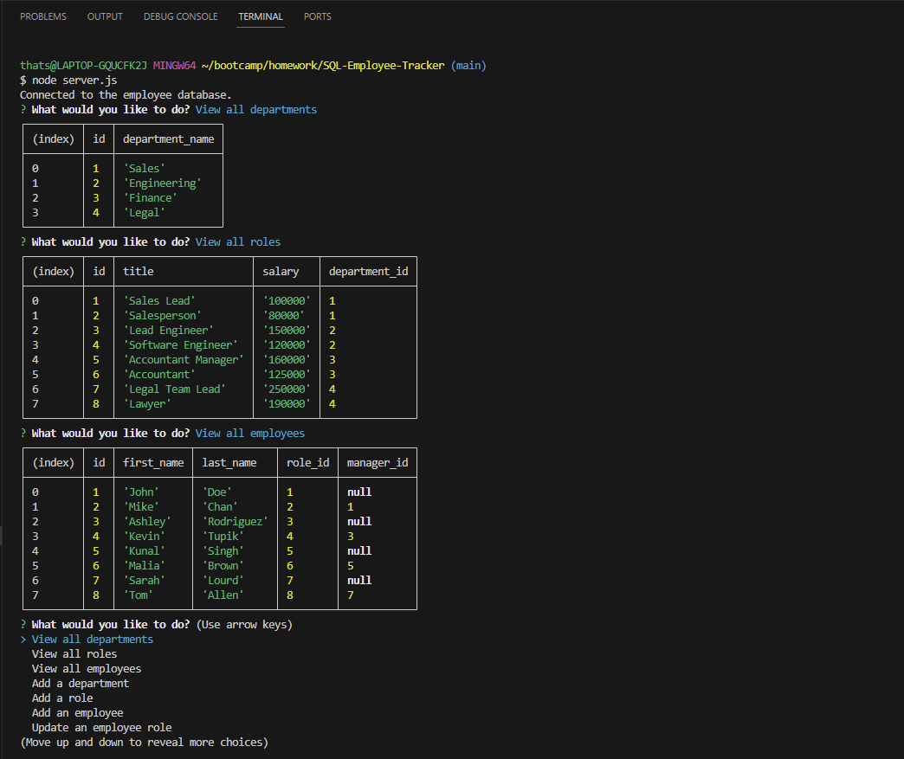

# SQL Employee Tracker

## Description

Git Repo: https://github.com/dnoon23/SQL-Employee-Tracker

This project was to create a employee tracker that used an SQL database.  Using the terminal, the user should be able to view all employees, view all roles, view all departments, add a department, add a role, add an employee, and update a current employee with a new role.  The most difficult parts were adding and updating the database.  Updating was especially difficult having to call 2 different tables.  

## Installation

This program requires msql and node.  To insall the dependancies, open the main directory in the terminal and type `npm install`

## Usage

Video demonstration: https://youtu.be/WNvr7MT8-XQ 

Open the main directory in the terminal and type `mysql -u root -p` to open mysql.  Then start the database with `SOURCE ./sql/schema.sql` and populate it with the seeds with `SOURCE ./sql/seeds.sql`.  After that you can exit mysql with `quit`.  Now, while still in the terminal, type `node server.js` to launch the program.  Navigate the program using the up and down keys and pressing enter on the desired option.  Some options require, others require numbers.  If an invalid answer is give the data will not be added to the tables.  Information will also not be added to role if it references a department that does not exit and an employee will not be added if it references a manager who does not exist.  When done with the program select the `Exit` option to close.

## Credits

Some code modified from code taken from: 
https://git.bootcampcontent.com/

## Features

This program inquirer to make selection and mysql to create a database.